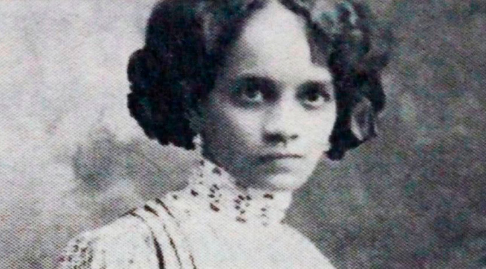

<!DOCTYPE html>

<html>

<head>
    <link rel="stylesheet" type="text/css" href="style.css">
    <link href="https://fonts.googleapis.com/css?family=Mulish" family=Mulish rel="stylesheet" type="text/css">
</head>

<body>

    <main id="main">

        <h1 id="title">Carmen Lyra</h1>

        <figure id="img-div">
            
            <figcaption id="img-caption">
                Young Carmen Lyra. Image from
                <a href="https://mujeresbacanas.com/carmen-lyra-1887-1949/">
                    Mujeres bacanas
                </a>.
            </figcaption>
        </figure>

        <section id="tribute-info">
            <ul>
                <li>15 January 1888, Carmen Isabel Carvajal Quesada was born in San José, Costa Rica.</li>
                <li>1906, she started working as a teacher and writer, send many articles to different newspapers and magazines.</li>
                <li>1918, she published her first novel <i>En una silla de ruedas</i>.</li>
                <li>1919, she participate in a teacher's protest against the dictadorship of Federico Tinoco and galvanized the crowd, which burned a goverment news office.</li>
                <li>1920, she published <i>Los Cuentos de Mi Tía Panchita.</i></li>
                <li>After the dictatorship, she receive a scholarship to Sorbonne and visited schools in Europe to evaluate pedagogical methods.</li>
                <li>1921, she managed the Department on Children's Literature at the Normal School of Costa Rica.</li>
                <li>1926, she founded and directed the first Montessori pre-kindergarden.</li>
                <li>1931, she was a co-founder of the Costa Rican Communist Party.</li>
                <li>1948, she was send to exile in Mexico after the Comunist Party was abolished.</li>
                <li>14 May 1949, Carmen Lyra died in Mexico City, Mexico.</li>
                <li>1976, she was awarded the honor of <i>Benemérita de la Cultura Nacional</i> by the Legislative Assembly of Costa Rica.</li>
            </ul>
        
            <a id="tribute-link" href="https://en.wikipedia.org/wiki/Carmen_Lyra" target="_blank">
                Read more about Carmen Lyra on her wikipedia page.
            </a>

        </section>

    </main>

</body>

</html>
